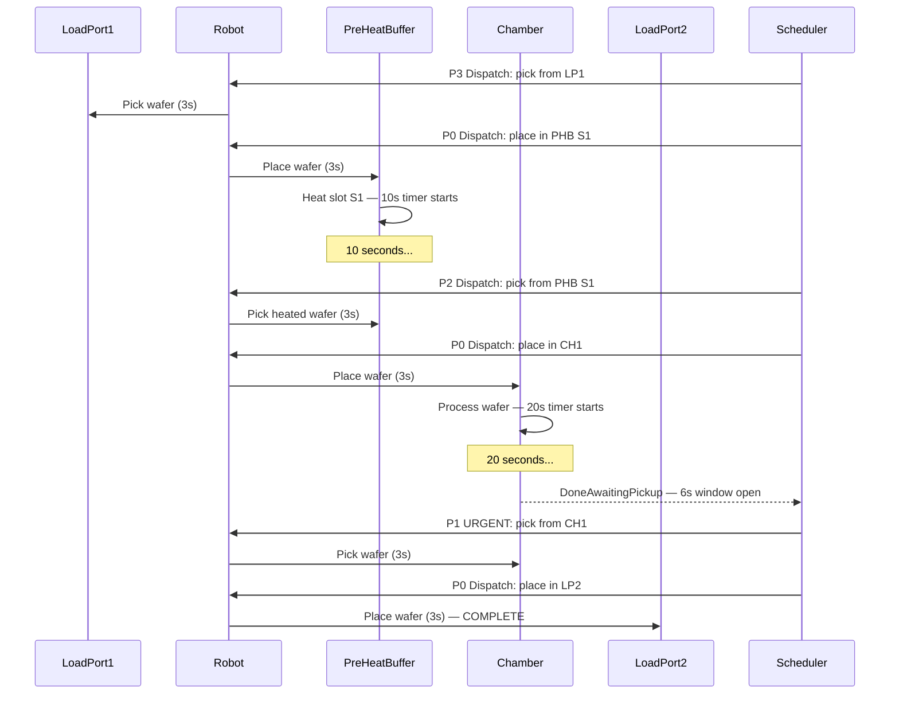
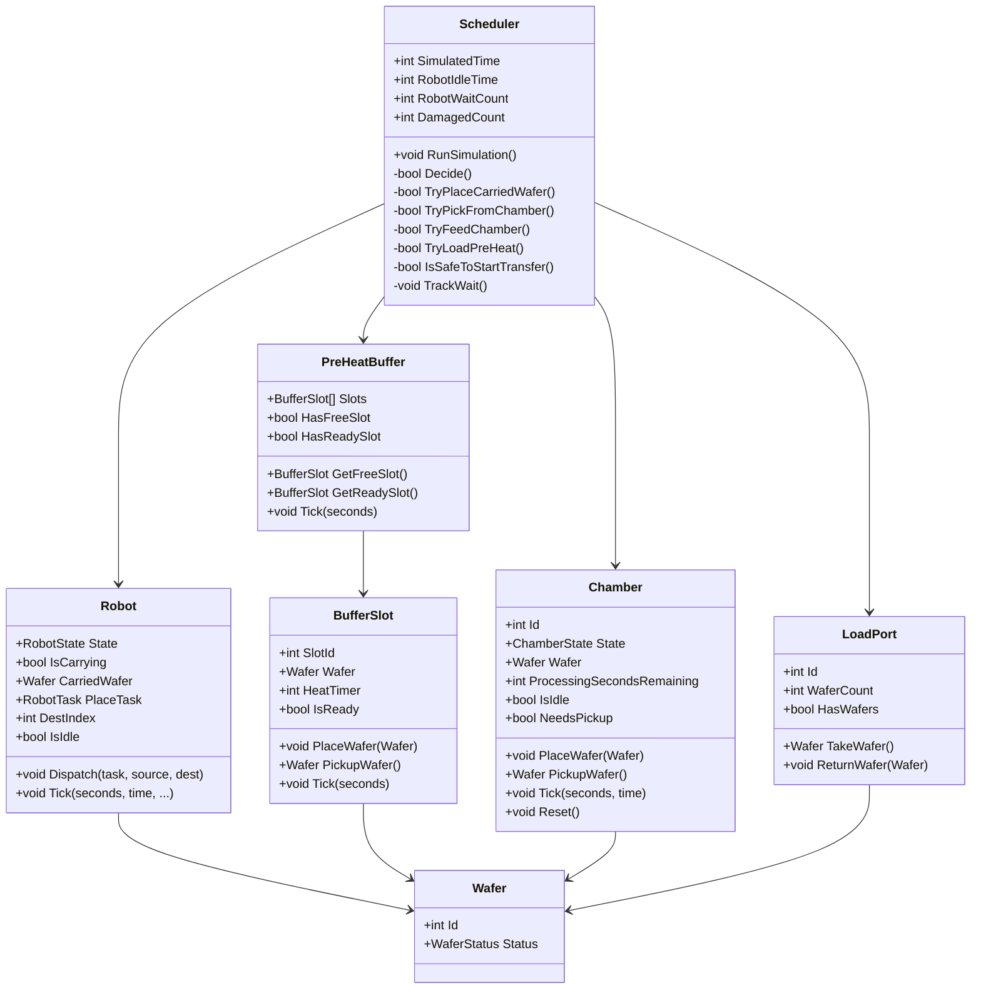
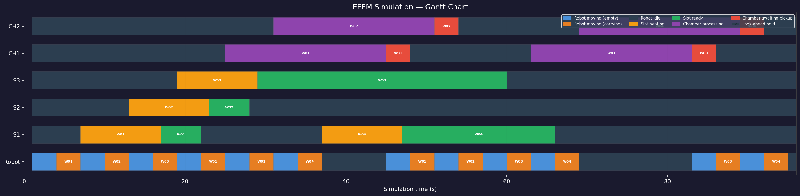

# EFEM Scheduler Simulation — Mindox Techno Assessment

A C# discrete-time simulation of an Equipment Front End Module (EFEM) for semiconductor wafer processing. The system moves 25 wafers from an input load port through a pre-heat buffer and two process chambers, then into an output load port — without damaging a single wafer.

---

## System Flow

```
LP1 (25 wafers) ──► Robot ──► PreHeatBuffer ──► Robot ──► CH1 / CH2 ──► Robot ──► LP2
                              (3 slots, 10s)              (20s process,
                                                           6s pickup window)
```

| Station | Detail |
|---|---|
| LoadPort 1 | Input — 25 wafers queued at start |
| PreHeatBuffer | 3 independent slots, 10s minimum heat, soft deadline |
| Chamber CH1 / CH2 | 20s processing, **6-second hard pickup window** |
| LoadPort 2 | Output — collects processed wafers |
| Robot | Single arm, 3s per move, carries one wafer at a time |

---

## Sequence Diagram



---

## Class Diagram



---

## Wafer Pipeline — Gantt Chart

The scheduler keeps multiple wafers in flight simultaneously. The chart below shows the first 4 wafers to illustrate how the pipeline overlaps across the pre-heat buffer and both chambers.



> Each robot transfer = 2 moves × 3s = 6s total. Heating and processing overlap across wafers — this is the pipeline the scheduler maintains.

---

## Scheduling Algorithm

The scheduler runs a fixed-priority decision every tick (P0 → P3, first match wins):

| Priority | Action | Why |
|---|---|---|
| **P0** | Place carried wafer at reserved destination | Robot is mid-transfer — always complete it first |
| **P1** | Pick from chamber (`DoneAwaitingPickup`) | Hard 6s deadline — most urgent |
| **P2** | Pick from PHB → place in free chamber | Keep the bottleneck busy |
| **P3** | Pick from LP1 → place in free PHB slot | Pipeline the next wafer |

**Look-ahead guard (`IsSafeToStartTransfer`):** Before starting any P2 or P3 transfer, the scheduler checks whether a processing chamber will finish before the robot could reach it. A transfer is blocked when `remaining < 4` seconds — the robot needs 9 seconds (3+3+3) to complete a transfer and arrive, while the pickup window adds 6 seconds, giving a safe threshold of 4.

---

## Project Structure

```
Mindox_Assignment/
├── EFEMSimulator/
│   ├── EFEMSimulator.csproj
│   ├── Program.cs                  ← entry point, wires components together
│   ├── Scheduler.cs                ← scheduling engine (P0–P3, look-ahead)
│   └── Models/
│       ├── Wafer.cs                ← wafer identity and status
│       ├── LoadPort.cs             ← input / output wafer store
│       ├── BufferSlot.cs           ← single pre-heat slot with timer
│       ├── PreHeatBuffer.cs        ← manages 3 slots, FIFO slot selection
│       ├── Chamber.cs              ← 20s process, 6s hard pickup window
│       └── Robot.cs                ← 3s moves, two-dispatch transfer model
└── docs/
    ├── design/
    │   └── design-decisions.md     ← all assumptions and design choices
    ├── reflection/
    │   └── reflection.md           ← simulation simplifications and trade-offs
    └── Research/
        └── reading_materials/      ← background theory (wafer fab, EFEM, FSM, scheduling)
```

---

## How to Run

**1. Clone the repository**

```bash
git clone https://github.com/Jenarththan2001/Mindox_Assignment.git
cd Mindox_Assignment
```

**2. Run the simulation**

```bash
cd EFEMSimulator
dotnet run
```

Or open `EFEMSimulator/EFEMSimulator.csproj` in Visual Studio 2022 and press **F5**.

> Requires [.NET 8 SDK](https://dotnet.microsoft.com/download) or later.

---

## Results

```
==============================================
  SIMULATION COMPLETE
==============================================
  Total wafers processed : 25
  Damaged wafers         : 0
  Total simulated time   : 507s
  Robot wait episodes    : 12
  Robot idle time        : 57s
==============================================
```

25 wafers processed, 0 damaged. The look-ahead guard successfully prevented every potential pickup window miss across the full 507-second run.
