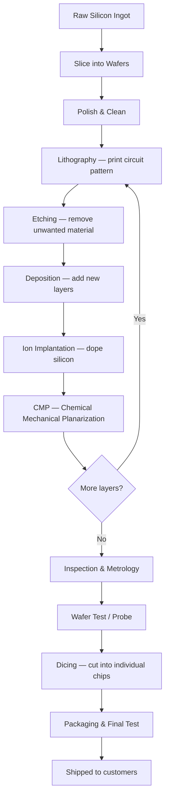

# 01 — Semiconductor Wafer Fabrication

## What is it?

Semiconductor fabrication (fab) is the process of building microchips on thin circular discs of silicon called **wafers**. Every phone, laptop, car ECU, and medical sensor contains chips made this way.

A single wafer (usually 300 mm diameter) goes through **hundreds of steps** in a cleanroom before becoming finished chips. The whole journey can take 3–4 months.

---

## The Big Picture Flow

---

## Key Concepts

### Wafer
- A disc of ultra-pure silicon, typically **300 mm** in diameter
- Holds hundreds of individual dies (chips)
- Must never be touched by bare hands — contamination kills yield

### Die
- One chip on the wafer
- If a die fails inspection, it is marked and discarded

### Cleanroom
- Fabrication happens in rooms rated by **particles per cubic metre**
- Class 1 = fewer than 1 particle > 0.5 µm per cubic foot
- Any contamination = scrapped wafer = huge money loss

### Yield
- Percentage of good dies per wafer
- A fab running at 95% yield is excellent
- Scheduler bugs (like the 6-second pickup window you must respect) directly destroy yield

---

## Process Steps Relevant to This Assessment

The assessment simulates a **single process step** inside a tool. In a real fab this would be one of hundreds. What matters for your code:

| Concept | Real World | Your Simulation |
|---|---|---|
| Load Port | Where cassettes of wafers dock to the tool | `LoadPort` class, holds 25 wafers |
| Robot | SCARA arm that moves wafers between stations | `Robot` class, 3-second move time |
| Pre-Heat Buffer | Warms wafer before entering process chamber | `PreHeatBuffer`, 3 slots, 10-second heat |
| Process Chamber | Where the actual process happens (etch, deposit, etc.) | `Chamber`, 20-second process, 6-second pickup window |
| EFEM | The front-end module that coordinates all of the above | The whole system you are building |

---

## Why Timing is Critical

In real semiconductor equipment:
- Wafers are often in a precise thermal state
- **Leaving a wafer in a chamber after processing = overprocessing = scrap**
- This is why the assessment has a **6-second window** — miss it, the wafer is permanently damaged

This is not academic. In a real tool this means tens of thousands of dollars of scrapped wafers.

---

## The Word "Scheduler" in Semiconductor Context

A **scheduler** in semiconductor equipment is not the same as an OS scheduler. It is:
- A real-time decision engine
- Runs continuously in a loop
- Answers: "What should the robot do RIGHT NOW?"
- Must account for: what is free, what is about to expire, what is next in queue

A good scheduler maximises throughput (wafers per hour) while preventing damage (no missed windows).

---

## Quick Vocab Cheat Sheet

| Term | Meaning |
|---|---|
| WPH | Wafers Per Hour — the key throughput metric |
| FOUP | Front Opening Unified Pod — the cassette that holds wafers |
| Lot | A batch of wafers processed together |
| Recipe | The sequence of steps a wafer goes through |
| Alarm / Fault | A system event that halts processing |
| OHT | Overhead Hoist Transport — moves FOUPs between tools in a fab |
| SEMI | Industry standards body for semiconductor equipment interfaces |

---

## What You Need to Remember for the Assessment

1. The load port holds wafers — the robot picks from it one at a time
2. Pre-heating is a time-based state (10 seconds, starts when wafer arrives)
3. Chamber processing is time-based (20 seconds) with a hard deadline after
4. The scheduler's job is to prevent the 6-second window from being missed
5. You are simulating an EFEM — the front-end of a semiconductor process tool
