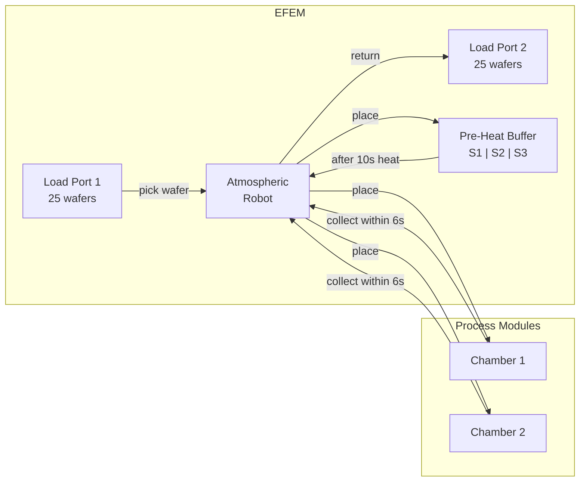
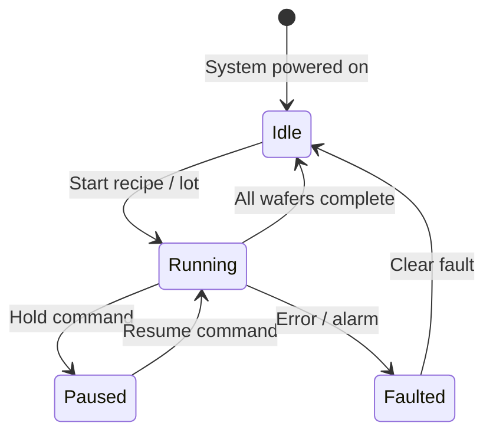
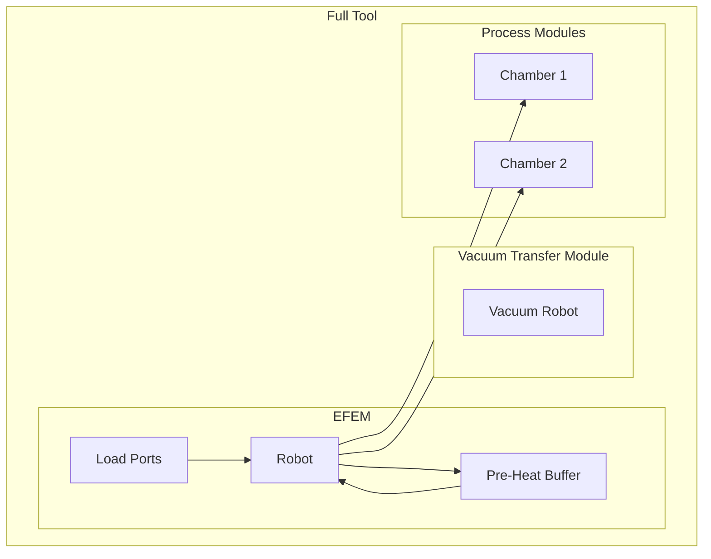
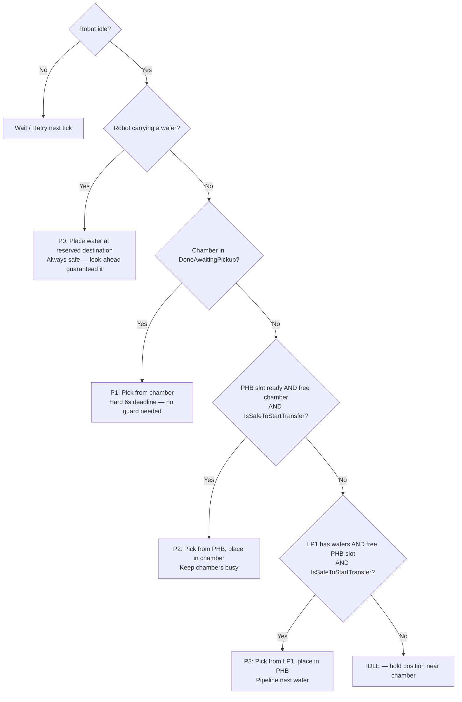

# 02 — EFEM (Equipment Front End Module)

## What is an EFEM?

An **EFEM** (Equipment Front End Module) is the entry and exit point of a semiconductor process tool. It sits between the cleanroom fab environment and the process modules (chambers) inside the tool.

Think of it as the **lobby and logistics hub** of a wafer processing machine.

---

## Physical Layout

---

## EFEM Components

### Load Ports
- The **docking points** where FOUPs (wafer cassettes) attach to the tool
- In your simulation: LP1 is the input (25 wafers), LP2 is the output (25 processed wafers)
- Robot picks from LP1; robot drops to LP2

### Atmospheric Robot (SCARA Robot)
- A robotic arm that operates in **atmospheric pressure** (normal air)
- Moves wafers between load ports, pre-heat buffer, and chambers
- Can only carry **one wafer at a time**
- Has an end effector (the blade/paddle that holds the wafer)
- In your simulation: every move = 3 seconds

### Pre-Heat Buffer (PHB)
- Warms wafers to the required process temperature before they enter the chamber
- Prevents thermal shock to the wafer when it enters the hot chamber
- Has multiple independent slots (your simulation: 3 slots — S1, S2, S3)
- Each slot heats independently: 10 seconds per wafer

### Process Chambers (CH1, CH2)
- Where the actual semiconductor process happens (etching, deposition, etc.)
- In your simulation: one wafer at a time, 20 seconds processing
- **Critical**: After processing completes, the robot must collect within 6 seconds or the wafer is damaged

---

## EFEM States — System Level

---

## How the EFEM Fits Into a Bigger Tool

> In a real tool the chambers might be under vacuum. The EFEM operates at atmospheric pressure. A **Load Lock** transitions wafers between atmospheric and vacuum. Your assessment simplifies this — no vacuum, just the EFEM logic.

---

## EFEM Scheduler Responsibilities

The EFEM scheduler must:

1. **Track all component states** at every moment
2. **Prioritise correctly** — chamber pickup > new wafer loading
3. **Prevent conflicts** — never move a robot to a busy slot
4. **Respect timing constraints** — 6-second pickup window is hard
5. **Maximise throughput** — keep the chambers busy, fill pre-heat slots proactively

### Priority Decision Tree

> `IsSafeToStartTransfer` blocks any transfer when a processing chamber has fewer than 4 seconds remaining (i.e. the robot could not reach the chamber within the pickup window). See doc 04 and 05 for the full logic.

---

## Key EFEM Metrics

| Metric | What It Measures |
|---|---|
| WPH (Wafers Per Hour) | Primary throughput measure |
| Robot Utilisation | % time robot is moving vs idle |
| Chamber Utilisation | % time chamber is processing |
| Mean Transfer Time | Average time to move one wafer |
| Damage Rate | % wafers damaged (should be 0) |

---

## What You Need to Remember for the Assessment

1. EFEM = front-end logistics module of a semiconductor tool
2. Your simulation IS an EFEM: LoadPort → Robot → Pre-Heat Buffer → Robot → Chamber → Robot → LoadPort
3. Two chambers (CH1, CH2) means more parallelism = higher throughput
4. The scheduler is the brain that orchestrates all moves
5. Chamber pickup priority is always highest — missing the 6-second window = damaged wafer
