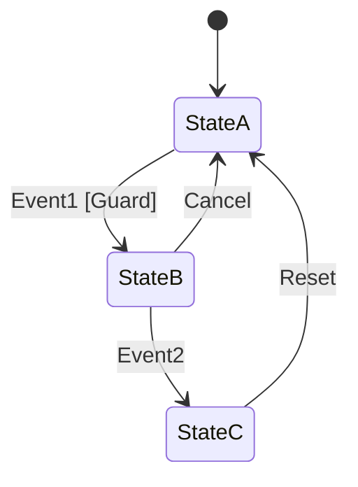
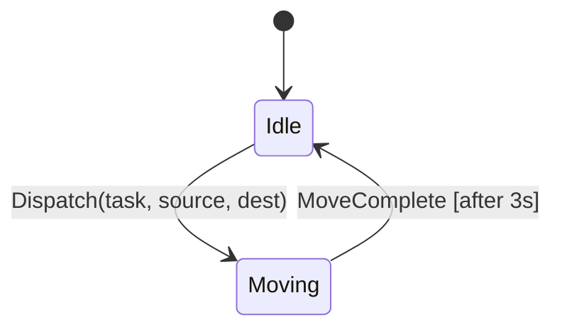
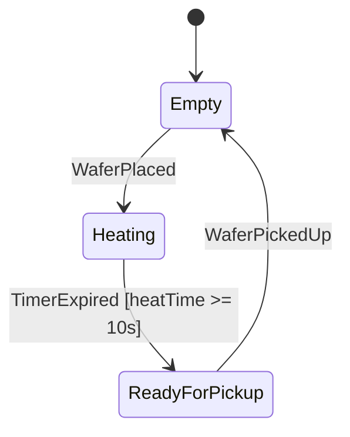
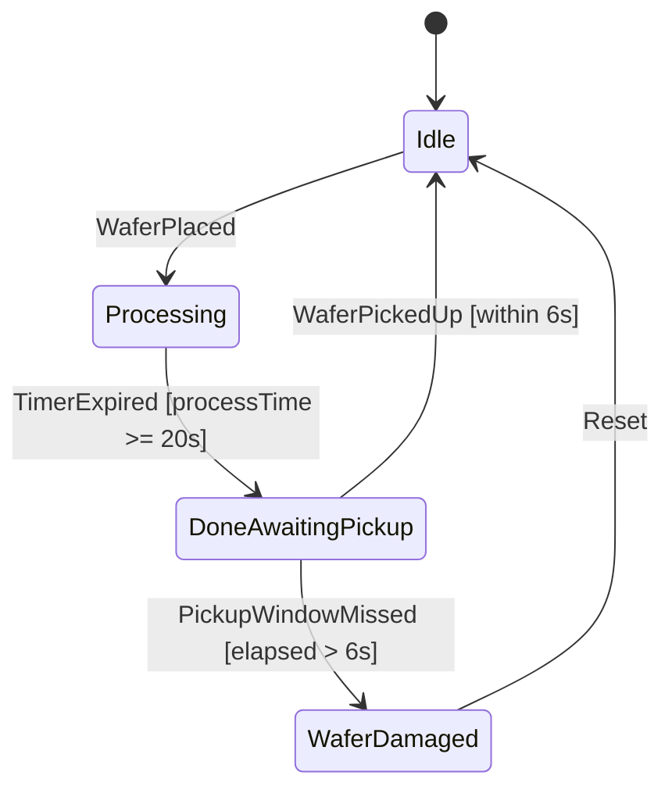
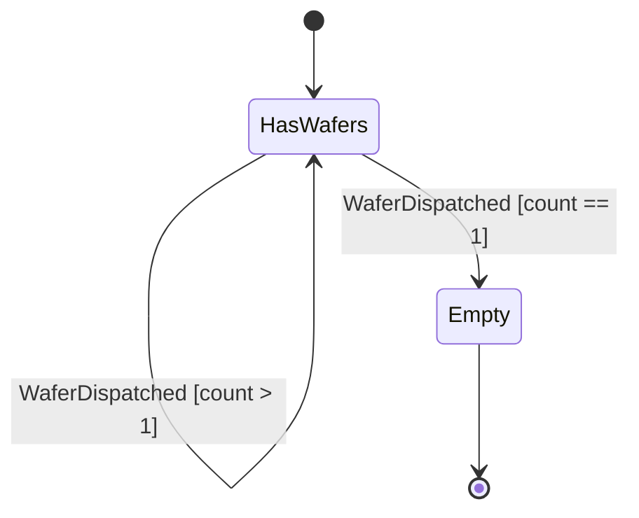
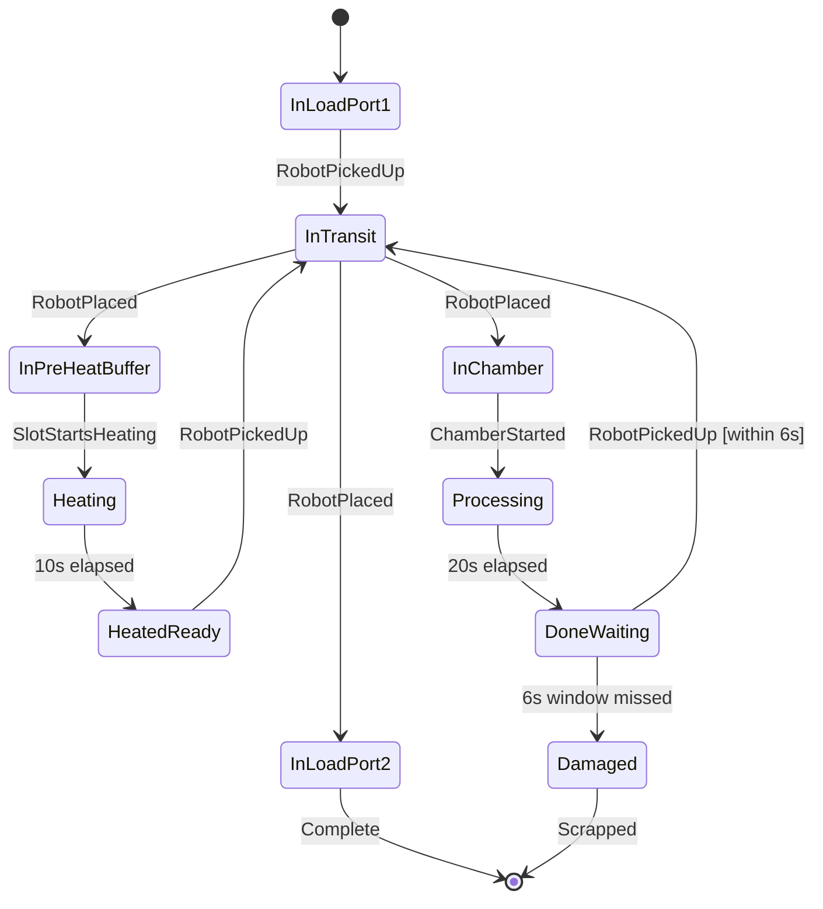
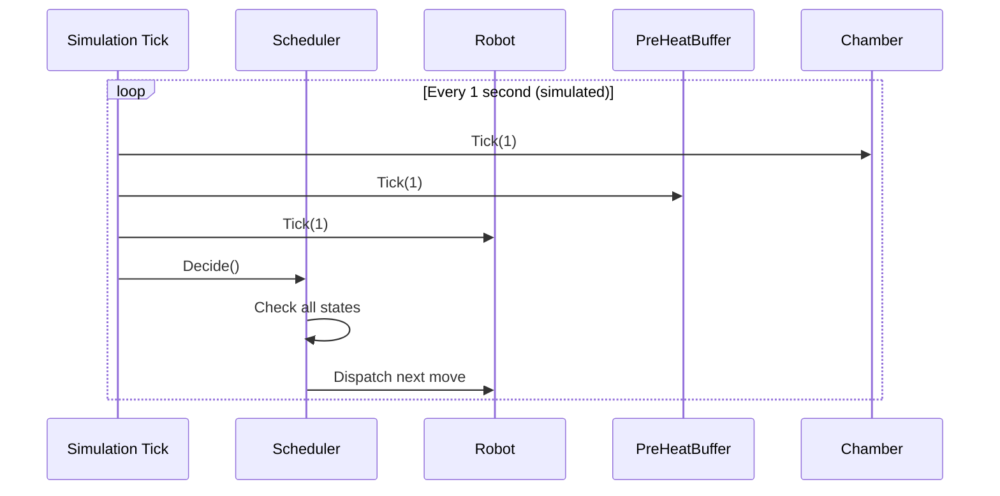

# 03 — State Machines in Software

## What is a State Machine?

A **finite state machine (FSM)** is a model where a system is always in exactly ONE state at a time. An event causes a **transition** from one state to another. Each state defines what the system does while in it.

Every component in your EFEM — the robot, each buffer slot, each chamber — IS a state machine.

---

## Core Concepts

| Term | Meaning |
|---|---|
| **State** | A distinct mode the object can be in (e.g., `Idle`, `Moving`, `Processing`) |
| **Transition** | A change from one state to another |
| **Event/Trigger** | What causes the transition (e.g., `PickupComplete`, `TimerExpired`) |
| **Guard** | A condition that must be true for a transition to fire |
| **Action** | Code that runs when a transition occurs |

---

## Generic State Machine Diagram



---

## State Machine for Each EFEM Component

### Robot State Machine

The robot uses a **2-state model** in this simulation — simpler and sufficient:



The robot tracks `IsCarrying` as a separate boolean — it stays true across two consecutive `Moving` states (pick move + place move):

```
Dispatch pick  → Moving (3s) → Idle, IsCarrying=true
Dispatch place → Moving (3s) → Idle, IsCarrying=false
```

**In C#:**
```csharp
public enum RobotState { Idle, Moving }
// IsCarrying tracked separately as bool
```

> The 5-state version (MovingToSource, PickingUp, MovingToDest, PlacingDown, Idle) is conceptually accurate but over-engineered for this simulation. Use 2-state in your code.

---

### Pre-Heat Buffer Slot State Machine

Each of the 3 slots in the PHB has its own independent state machine:



**Key point**: When state is `ReadyForPickup`, the scheduler should pick this wafer and move it to a free chamber.

**In C#:**
```csharp
public enum BufferSlotState
{
    Empty,
    Heating,
    ReadyForPickup
}
```

---

### Chamber State Machine



**Critical**: The transition from `DoneAwaitingPickup` to `WaferDamaged` is time-driven and automatic. Your scheduler must prevent this.

**In C#:**
```csharp
public enum ChamberState
{
    Idle,
    Processing,
    DoneAwaitingPickup,
    WaferDamaged
}
```

**Damaged chamber recovery — must handle this in code:**

`WaferDamaged → Idle: Reset` in the diagram requires an explicit call. Without it, the chamber is stuck forever and the simulation never ends (hits the 2000s cap).

Handle it at the top of the main loop or in `Decide()`:

```csharp
// At the start of each tick, before Decide():
foreach (var ch in _chambers)
{
    if (ch.State == ChamberState.WaferDamaged)
    {
        damagedCount++;
        ch.Reset(); // clears wafer, sets State = Idle, resets timers
        Console.WriteLine($"[t={simulatedTime}s] !!! WAFER DAMAGED in {ch.Id} — chamber reset");
    }
}

// End condition accounts for damaged wafers:
bool allDone = (loadPort2.WaferCount + damagedCount) == 25;
```

This keeps the simulation running even if a wafer is damaged, and your final stats can report `Damaged wafers: X`.

---

### Load Port State Machine



---

### Wafer State Machine

A wafer itself has a lifecycle:



---

## Implementing State Machines in C#

### Pattern 1 — Enum + Switch (Simple, good for this assessment)

```csharp
public class Chamber
{
    public ChamberState State { get; private set; } = ChamberState.Idle;
    private int _elapsedSeconds = 0;
    private int _postProcessSeconds = 0;

    public void Tick(int seconds)
    {
        switch (State)
        {
            case ChamberState.Processing:
                _elapsedSeconds += seconds;
                if (_elapsedSeconds >= 20)
                {
                    State = ChamberState.DoneAwaitingPickup;
                    _postProcessSeconds = 0;
                    Console.WriteLine("Chamber processing complete — pickup window open");
                }
                break;

            case ChamberState.DoneAwaitingPickup:
                _postProcessSeconds += seconds;
                if (_postProcessSeconds > 6)
                {
                    State = ChamberState.WaferDamaged;
                    Console.WriteLine("!!! WAFER DAMAGED — pickup window missed !!!");
                }
                break;
        }
    }

    public void PlaceWafer()
    {
        if (State != ChamberState.Idle)
            throw new InvalidOperationException("Chamber not idle");
        State = ChamberState.Processing;
        _elapsedSeconds = 0;
    }

    public void PickupWafer()
    {
        if (State != ChamberState.DoneAwaitingPickup)
            throw new InvalidOperationException("No wafer ready");
        State = ChamberState.Idle;
    }
}
```

### Pattern 2 — State Pattern (OOP, more complex)

Each state is a class. Not needed for this assessment but good to know:

```csharp
// Abstract state
public abstract class ChamberStateBase
{
    public abstract void Tick(Chamber context, int seconds);
}

// Concrete states
public class ProcessingState : ChamberStateBase
{
    public override void Tick(Chamber context, int seconds) { /* ... */ }
}
```

---

## The Simulation Loop and State Machines

Your simulation uses a **discrete time loop** — every iteration of the loop represents 1 second of simulated time:



---

## Key Insight: Guards Prevent Invalid Transitions

Guards are conditions checked before allowing a transition:

| Transition | Guard |
|---|---|
| Robot places wafer in PHB slot | Slot must be `Empty` |
| Robot picks wafer from PHB | Slot must be `ReadyForPickup` AND a free chamber exists AND `IsSafeToStartTransfer()` |
| Robot places wafer in Chamber | Chamber must be `Idle` |
| Robot picks wafer from Chamber | Chamber must be `DoneAwaitingPickup` |
| Scheduler dispatches any new pick | Robot must be `Idle` AND `IsCarrying == false` |
| Scheduler dispatches place | Robot must be `Idle` AND `IsCarrying == true` (Priority 0) |
| Scheduler starts LP1→PHB transfer | `IsSafeToStartTransfer()` must return true |

In C# these become `if` checks before you execute any move.

---

## What You Need to Remember for the Assessment

1. Every component (Robot, Buffer slots, Chambers) has a state — model it with an enum
2. States change only on valid transitions — use guards (if-checks)
3. The simulation loop calls `Tick(1)` on everything each second — time-driven transitions happen here
4. The scheduler reads all states each tick and decides what the robot does next
5. State machines make bugs obvious: if a component is in the wrong state, log it — "you cannot debug what you cannot see"
