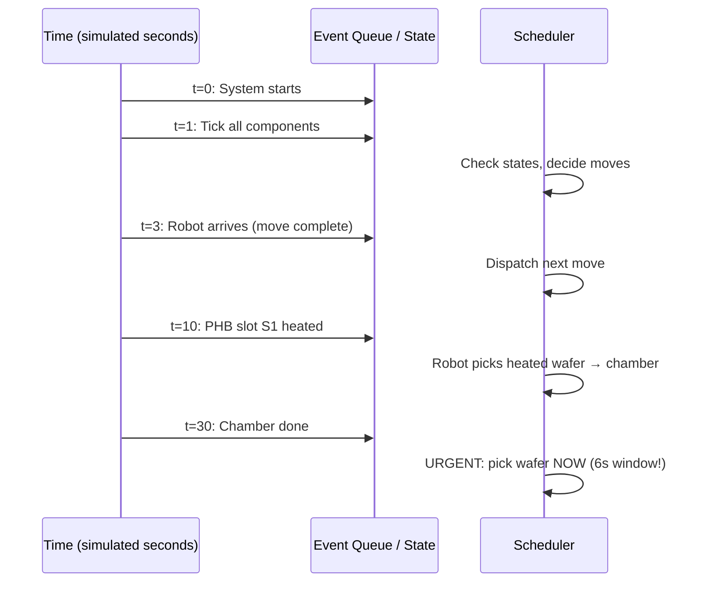
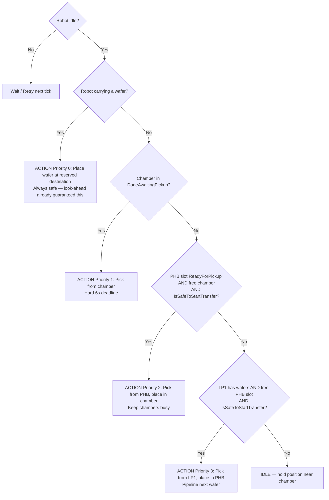

# 04 — Real-Time Scheduling

## What is Real-Time Scheduling?

**Real-time scheduling** is about making decisions under timing constraints where being late has consequences — ranging from degraded performance to catastrophic failure.

In your EFEM:
- Missing the **6-second chamber pickup window** = permanently damaged wafer = real-time hard deadline
- Robot waiting too long = wasted throughput = soft deadline

---

## Two Types of Real-Time Constraints

| Type | Description | Example in EFEM |
|---|---|---|
| **Hard deadline** | Must be met. Missing it = system failure | Chamber 6-second pickup window |
| **Soft deadline** | Should be met. Missing it = degraded performance | Robot idle time, throughput |

Your scheduler must guarantee the hard deadline and optimise for the soft ones.

---

## Discrete Event Simulation

Your assessment uses a **discrete event simulation** approach — simulated time advances in fixed steps (1 second per loop iteration).



### Why 1-second ticks?

Simplicity. A real system would use millisecond timers and callbacks. For simulation, ticking every 1 second lets you:
- Advance all timers uniformly
- Check state after each second
- Never miss the 6-second window (you check every second)

---

## Scheduling Algorithms (Context)

These are classic algorithms — understand the concepts, apply the ideas to your scheduler:

### First Come First Served (FCFS)
- Process tasks in the order they arrive
- Simple, fair, but ignores urgency
- **Problem for EFEM**: doesn't prioritise chamber pickup

### Priority Scheduling
- Assign priority levels; highest priority runs first
- Your EFEM uses this: chamber done = highest priority
- Works well when priorities are clear and stable

### Earliest Deadline First (EDF)
- The task with the nearest deadline runs first
- Applied to your EFEM: a chamber with 2 seconds left in its window beats everything
- Note: EDF is optimal for preemptive scheduling with independent tasks. Your robot can't drop a wafer mid-move (non-preemptive), so say "EDF-style thinking" rather than claiming full EDF optimality

### Round Robin
- Each task gets a time slice; rotate through them
- Good for fairness, not for hard deadlines

---

## Your Scheduler's Priority Hierarchy

This is the critical design decision the assessment asks about ("When a chamber just finished and a new wafer is also ready to move, which one does the robot handle first and why?"):



> **Priority 0 explained:** After picking from LP1 or PHB, the robot is idle but still holding a wafer. Without Priority 0, the tree would skip to "chamber done?" and try to pick from a chamber while the hand is full — impossible. Priority 0 ensures the robot always completes its current transfer before doing anything else. Reserve the destination at pick time (`_targetSlot = S1`) so the place step always knows where to go.

> **IsSafeToStartTransfer logic:** Robot needs 9s to reach the chamber after starting a transfer (3+3+3). Chamber deadline = remaining processing time + 6s window. Block transfer if `9 > (remaining + 6 - safetyMargin)`, which simplifies to block if `remaining < 4` (with SafetyMargin=1). This is more precise than blocking for the full 9s — it correctly accounts for the 6-second pickup window.

### The Answer to Their Question

> "When a chamber just finished and a new wafer is also ready to move, which one does the robot handle first and why?"

**Answer: The chamber pickup ALWAYS wins.**

**Why:**
1. The chamber has a **hard deadline** — 6 seconds, then wafer is permanently damaged (unrecoverable)
2. A pre-heated wafer sitting in the buffer is not going anywhere — it just waits (no damage)
3. Missing a chamber pickup = scrapped wafer = failed simulation
4. Delaying a buffer-to-chamber move = robot waits one more cycle = minor throughput loss

This is **EDF-style thinking** applied to your specific system.

---

## Pipeline Thinking

Good scheduling pipelines work so that no station starves. Think of it like a factory assembly line:

```mermaid
gantt
    title Wafer Pipeline (Optimal)
    dateFormat ss
    axisFormat %S s

    section Wafer 1
    LP1→PHB (Robot, 3s)     :w1_a, 00, 3s
    PHB Heating (10s)        :w1_b, after w1_a, 10s
    PHB→CH1 (Robot, 3s)     :w1_c, after w1_b, 3s
    CH1 Processing (20s)     :w1_d, after w1_c, 20s
    CH1→LP2 (Robot, 3s)     :w1_e, after w1_d, 3s

    section Wafer 2
    LP1→PHB (Robot, 3s)     :w2_a, 03, 3s
    PHB Heating (10s)        :w2_b, after w2_a, 10s
    PHB→CH2 (Robot, 3s)     :w2_c, after w2_b, 3s
    CH2 Processing (20s)     :w2_d, after w2_c, 20s
    CH2→LP2 (Robot, 3s)     :w2_e, after w2_d, 3s
```



With 3 PHB slots and 2 chambers, the scheduler keeps multiple wafers in flight simultaneously.

> **Note:** The Gantt shows each robot leg as 3s, which is the travel time per move. Under the 2-dispatch model, a full LP1→PHB transfer is 6s (pick move + place move). Treat this chart as illustrative — your actual output will show 6s per transfer.

---

## Robot Idle Time Analysis

Your simulation must track **robot idle time**. This happens when:
1. All PHB slots are occupied (heating)
2. All chambers are busy (processing)
3. No wafer is ready in PHB to move to a chamber
4. No loadport wafer can be placed (PHB full)

The scheduler's job is to minimise unproductive idle time by proactively pipelining. Note: with look-ahead, the robot will sometimes idle **on purpose** (holding position near a chamber about to finish). This is correct behaviour — mention it in your reflection so the idle-time stat doesn't look like a flaw.

---

## What "Robot Had to Wait — Destination Occupied" Means

This counter tracks how many **episodes** the robot wanted to move but all valid destinations were busy. Count once per episode — not once per tick — otherwise the number becomes meaningless.

```csharp
bool wasWaiting = false;

// Inside the simulation loop each tick:
bool waiting = robot.IsIdle() &&
    ((lp1HasWafers && phbFull) ||          // want to load PHB but it's full
     (phbHasReadyWafer && allChambersBusy)); // want to feed chamber but both busy

if (waiting)
{
    if (!wasWaiting)        // first tick of a new wait episode
    {
        robotWaitCount++;
        wasWaiting = true;
    }
}
else
{
    wasWaiting = false;     // situation cleared, reset for next episode
}
```

This happens in your simulation when:
- LP1 has wafers but all 3 PHB slots are occupied (heating)
- A heated wafer is ready but both chambers are busy processing

> Note: the robot must be **idle** for these to count — if the robot is mid-move it isn't waiting, it's working.

---

## Implementing the Simulation Loop in C#

```csharp
// Pseudocode for the main loop
int simulatedTime = 0;
int robotIdleTime = 0;
int robotWaitCount = 0;

while (!allWafersComplete && simulatedTime < 2000) // safety cap prevents infinite loop on bugs
{
    // 1. Advance all timers first
    preHeatBuffer.Tick(1);
    chamber1.Tick(1);
    chamber2.Tick(1);
    robot.Tick(1);

    simulatedTime++;  // increment AFTER ticks so t=1 is after the first second

    // 2. Scheduler decides what robot does next
    bool robotDispatched = scheduler.Decide();

    // 3. Track idle time
    if (robot.IsIdle() && !robotDispatched)
        robotIdleTime++;
}

if (simulatedTime >= 2000)
    Console.WriteLine("WARNING: simulation hit time cap — check for deadlock or stuck state");

// Print final stats
Console.WriteLine($"Total time: {simulatedTime}s");
Console.WriteLine($"Robot waits (destination occupied): {robotWaitCount}");
Console.WriteLine($"Robot idle time: {robotIdleTime}s");
```

> **Loop ordering assumption (write this down):** `simulatedTime` increments after `Tick()` so the first scheduler decision happens at `t=1`, not `t=0`. This is fine — just be consistent and state it if asked.

> **Window boundary assumption (write this down):** A pickup at exactly 6s after chamber completion is treated as **valid** (`> 6` causes damage, not `>= 6`). State this assumption in your reflection.

---

## Expected Simulation Time

With 25 wafers and the 2-dispatch model (each transfer = 2 moves × 3s = 6s):
```
25 wafers × 6 moves × 3s = 450s minimum robot work alone
```
Add heating (10s) and processing (20s) overlaps, and expect roughly **460–520s total**.

> **The robot is the bottleneck** — not the chambers. This is worth saying in your reflection. The chambers could process faster but the robot can only move one wafer at a time. This is why look-ahead matters: every second of unnecessary robot idle time directly extends total simulation time.

---

## What You Need to Remember for the Assessment

1. **Priority 0 — place carried wafer**: Always complete current transfer first
2. **Priority 1 — chamber pickup**: Hard 6s deadline, no guard needed
3. **Priority 2 — feed chamber**: PHB→Chamber only if `IsSafeToStartTransfer()` passes
4. **Priority 3 — pipeline**: LP1→PHB only if `IsSafeToStartTransfer()` passes
5. **Look-ahead guard**: Block any transfer if `remaining < 4` (remaining < 3 + 1s safety margin)
6. **Count wait episodes**: Use `wasWaiting` flag — one count per episode, not per tick
7. **Robot is the bottleneck**: Expect ~460–520s total for 25 wafers
8. **State your assumptions**: Window boundary (`> 6`), loop ordering (first dispatch at t=1)
