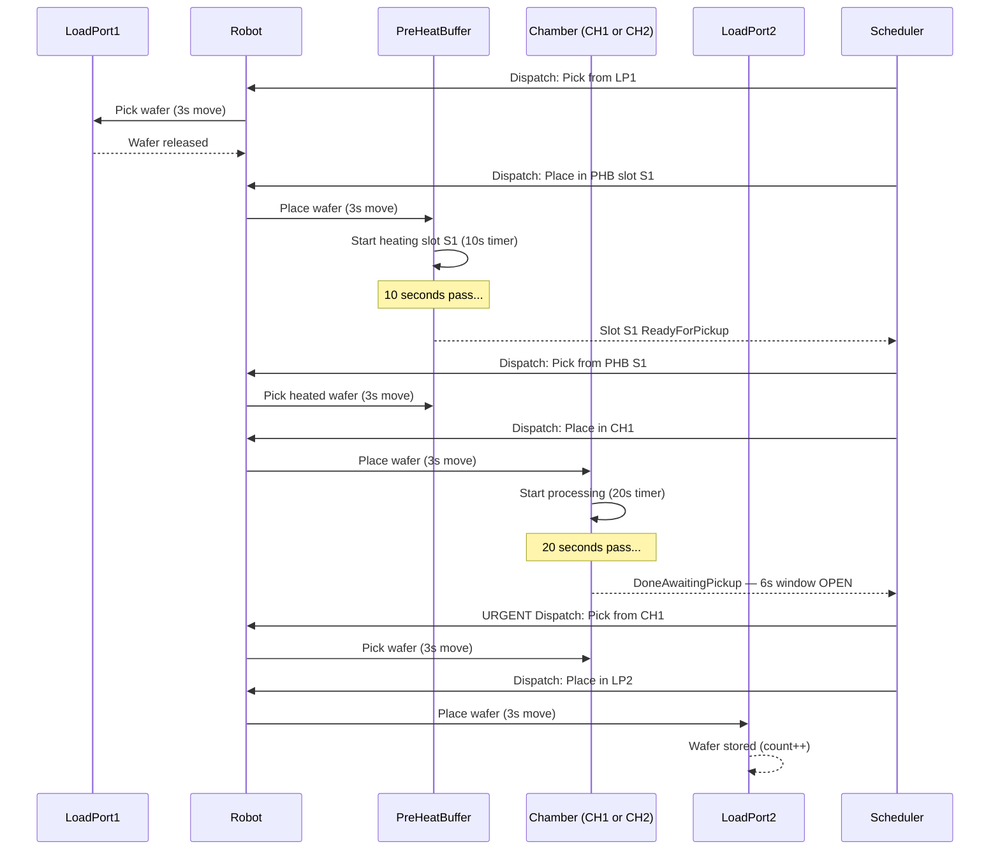
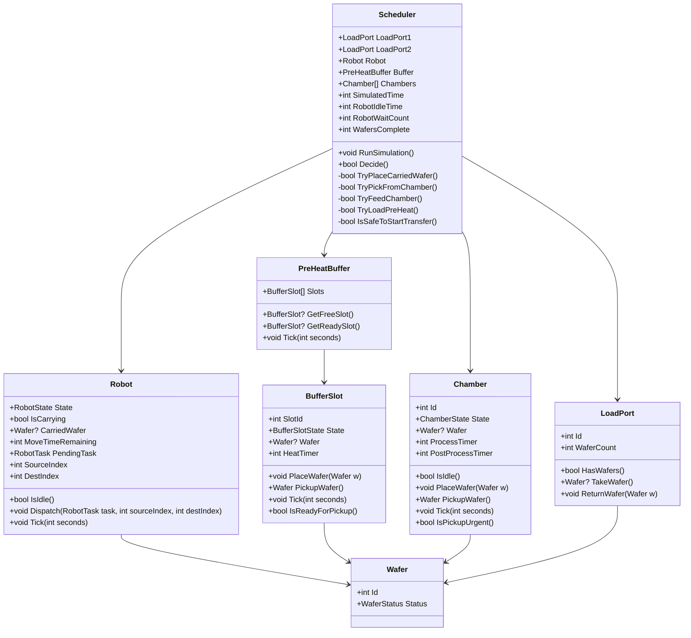

# 05 — System Design (Your Blueprint Before Coding)

> This is your "design on paper" step from the assessment. Read this BEFORE opening Visual Studio.

---

## Full System Flow — Sequence Diagram



---

## Class Diagram



---

## Enums

```csharp
public enum RobotState
{
    Idle,
    Moving   // simplify: robot is "moving" while a timer counts down
}

public enum BufferSlotState
{
    Empty,
    Heating,
    ReadyForPickup
}

public enum ChamberState
{
    Idle,
    Processing,
    DoneAwaitingPickup,
    WaferDamaged
}

public enum WaferStatus
{
    InQueue,
    InTransit,
    Heating,
    Processing,
    Complete,
    Damaged
}
```

---

## Key Design Decisions

### Decision 1: How does the Robot track time?

The robot takes 3 seconds per move. Use a countdown timer:

```csharp
// When robot starts a move:
_moveTicks = 3;

// In Tick(1):
if (_moveTicks > 0)
{
    _moveTicks--;
    if (_moveTicks == 0)
    {
        State = RobotState.Idle;
        // Execute the action that was queued (place or pickup)
    }
}
```

### Decision 2: How does the Scheduler know what move the Robot is currently doing?

The robot needs to remember its **pending action** (what to do when it arrives):

```csharp
public enum RobotTask { None, PickFromLP1, PlaceInPHB, PickFromPHB, PlaceInChamber, PickFromChamber, PlaceInLP2 }

private RobotTask _pendingTask;
private int _sourceIndex; // where robot is picking from (-1 if not applicable)
private int _destIndex;   // reserved destination — Priority 0 reads this
```

### Decision 3: Chamber pickup — dispatch immediately when window opens

When a chamber enters `DoneAwaitingPickup`, the scheduler must dispatch the robot to collect it **on that same tick** — provided the robot is idle. The robot then takes 3 seconds to travel, picking up the wafer at second 3 of the 6-second window.

**But "dispatch immediately" is only safe if the robot is already idle and empty-handed.** If the robot is mid-move (e.g., currently travelling to LP1), it could take up to 6s to finish its current move + travel to chamber = window missed. This is why Decision 5 (look-ahead) is critical.

### Decision 4: Two chambers — which to feed first?

When both CH1 and CH2 are idle and a preheated wafer is available, pick `CH1` by default. A simple "prefer lower ID" rule is enough — keep it simple.

---

### Decision 5: Look-ahead — don't start a transfer if it would miss a chamber window

This is the hardest scheduling decision. Before starting **any** transfer (LP1→PHB or PHB→Chamber), the scheduler must check if a chamber will finish before the robot could collect it.

**Correct math:**
```
Robot arrival at chamber = 9s from now
  (3s pick + 3s place + 3s travel to chamber)

Chamber deadline = remaining processing time + 6s pickup window

Safe to transfer if:  9 ≤ remaining + 6
                 i.e. remaining ≥ 3

Block transfer if:    remaining < 4  (remaining < 3, plus 1s safety margin)
```

The earlier "block if remaining ≤ 9" was **too conservative** — it ignores the 6-second pickup window the robot has after the chamber finishes. The wafer doesn't need collecting the instant the chamber stops; it needs collecting within 6s. So only block when `remaining < 4` (with SafetyMargin=1).

**Apply this guard to BOTH transfer types** — LP1→PHB and PHB→Chamber share the same 9s robot arrival time:

```csharp
private const int SafetyMargin = 1; // absorbs tick-ordering edge cases

private bool IsSafeToStartTransfer()
{
    int robotArrivalTime = 3 + 3 + 3; // pick + place + travel to chamber = 9s

    foreach (var ch in _chambers)
    {
        if (ch.State != ChamberState.Processing) continue;

        int remaining = 20 - ch.ProcessTimer;
        int deadline  = remaining + 6;  // robot must arrive before this

        if (robotArrivalTime > deadline - SafetyMargin)
            return false; // starting this transfer risks missing the window
    }
    return true;
}
// With SafetyMargin = 1: blocks when remaining < 4 (i.e. 9 > remaining + 6 - 1 → remaining < 4)
```

**Use it in both transfer methods:**
```csharp
private bool TryLoadPreHeat()
{
    if (!IsSafeToStartTransfer()) return false;
    var freeSlot = _buffer.GetFreeSlot();
    if (freeSlot == null || !_loadPort1.HasWafers()) return false;
    _robot.Dispatch(RobotTask.PickFromLP1, sourceIndex: -1, destIndex: freeSlot.SlotId);
    return true;
}

private bool TryFeedChamber()
{
    if (!IsSafeToStartTransfer()) return false;
    var readySlot = _buffer.GetReadySlot();
    var freeChamber = GetFreeChamber();
    if (readySlot == null || freeChamber == null) return false;
    _robot.Dispatch(RobotTask.PickFromPHB, sourceIndex: readySlot.SlotId, destIndex: freeChamber.Id);
    return true;
}
```

> **Why chamber pickup (Priority 1) doesn't need this guard:** The robot places one wafer at a time, so the two chambers always finish at least 6s apart. When you're collecting from CH1, CH2 can't also be in its window simultaneously. Mentioning this in the walkthrough is a strong point.

**Intentional idle time:** When the guard blocks a transfer, the robot sits idle on purpose near the chamber. This is correct behaviour — mention it in your reflection so the idle-time stat doesn't look like a flaw.

---

## Robot Move Timeline (What the Scheduler Dispatches)

Each "robot move" from the scheduler's perspective is actually a **two-step dispatch**:

```
Step 1: Scheduler sees PHB slot S1 ready + CH1 idle
        → Dispatch Robot: "Go pick from PHB S1" (3 seconds)
Step 2: Robot arrives, picks wafer, is now Idle again
        → Scheduler immediately dispatches: "Go place in CH1" (3 seconds)
Step 3: Robot places wafer, CH1 starts processing, robot is Idle
```

So every wafer transfer = **2 robot dispatches × 3 seconds = 6 seconds total transfer time**.

---

## Event Log Format

The assessment says "Print every event." Suggested format:

```
[t=000s] SCHED   Dispatch: Robot → pick from LoadPort1
[t=003s] ROBOT   Picked wafer W01 from LoadPort1       ← arrived after 3s travel
[t=003s] SCHED   Dispatch: Robot → place in PHB Slot S1
[t=006s] ROBOT   Placed wafer W01 in PHB Slot S1       ← arrived after 3s travel
[t=006s] PHB-S1  Heating started (W01) — completes at t=16s

[t=006s] SCHED   Dispatch: Robot → pick from LoadPort1 (W02)
[t=009s] ROBOT   Picked wafer W02 from LoadPort1
[t=009s] SCHED   Dispatch: Robot → place in PHB Slot S2
[t=012s] ROBOT   Placed wafer W02 in PHB Slot S2
[t=012s] PHB-S2  Heating started (W02) — completes at t=22s

[t=016s] PHB-S1  Heating complete (W01) — ready for pickup
[t=016s] SCHED   Dispatch: Robot → pick from PHB Slot S1
[t=019s] ROBOT   Picked wafer W01 from PHB Slot S1
[t=019s] SCHED   Dispatch: Robot → place in Chamber CH1
[t=022s] ROBOT   Placed wafer W01 in Chamber CH1
[t=022s] CH1     Processing started (W01) — completes at t=42s

[t=042s] CH1     Processing complete (W01) — pickup window open (6s)
[t=042s] SCHED   URGENT Dispatch: Robot → pick from Chamber CH1
[t=045s] ROBOT   Picked wafer W01 from Chamber CH1     ← at 3s of 6s window, safe
[t=045s] SCHED   Dispatch: Robot → place in LoadPort2
[t=048s] ROBOT   Placed wafer W01 in LoadPort2
[t=048s] COMPLETE W01 done
```

> Every robot action requires 3 seconds of travel before it executes. The scheduler dispatches at t=X; the robot acts at t=X+3.

---

## Final Stats Format

```
==============================================
  SIMULATION COMPLETE
==============================================
  Total wafers processed : 25
  Total simulated time   : XXXs
  Damaged wafers         : 0
  Robot waits (dest busy): X times
  Robot idle time        : Xs
==============================================
```

---

## Tools Setup

### Install (one time)

1. **Visual Studio 2022 Community** (free): [visualstudio.microsoft.com](https://visualstudio.microsoft.com/vs/community/)
   - During install, select: **".NET desktop development"** workload
   - This includes the C# compiler, .NET 8 SDK, and debugger

2. **OR VS Code** (lighter):
   - Install VS Code
   - Install the **C# Dev Kit** extension (by Microsoft)
   - Install **.NET 8 SDK** separately from [dot.net](https://dotnet.microsoft.com/download)

### Create the Project

```bash
# In terminal / VS Developer Command Prompt:
dotnet new console -n EFEMSimulator
cd EFEMSimulator
```

Or in Visual Studio: **File → New → Project → Console App (.NET 8)**

### Project Structure

```
EFEMSimulator/
├── EFEMSimulator.csproj
├── Program.cs          ← entry point, creates Scheduler and calls RunSimulation()
├── Wafer.cs
├── LoadPort.cs
├── Robot.cs
├── BufferSlot.cs
├── PreHeatBuffer.cs
├── Chamber.cs
└── Scheduler.cs        ← the hard part
```

---

## Study Order Checklist

- [ ] Read `01-semiconductor-wafer-fabrication.md` — understand the context
- [ ] Read `02-efem-overview.md` — understand the physical system
- [ ] Read `03-state-machines.md` — understand how each component behaves
- [ ] Read `04-realtime-scheduling.md` — understand the scheduling decisions
- [ ] Read this file (`05-system-design.md`) — understand the full design
- [ ] Install Visual Studio 2022 Community
- [ ] Create the C# project
- [ ] Build one class at a time, test each one
- [ ] Build Scheduler last
- [ ] Run with 1 wafer first, then 5, then 25
- [ ] Clean up code and write reflection

---

## The One Question You Must Be Able to Answer

> "When a chamber just finished and a new wafer is also ready to move, which one does the robot handle first and why?"

**Answer (memorise this):**

The robot picks from the chamber first. The chamber has a **hard real-time deadline** — if the wafer is not collected within 6 seconds of processing completing, it is permanently damaged with no recovery possible. A pre-heated wafer waiting in the buffer has no such deadline; it simply waits. Prioritising the chamber pickup protects product quality. This is **EDF-style thinking** — serve the task with the nearest hard deadline before everything else. Beyond reacting to a finished chamber, the scheduler also uses **look-ahead**: before starting any transfer it checks whether the robot could arrive at the chamber after that chamber's pickup deadline (`remaining + 6`). If the transfer would cause a miss, the robot holds position and waits instead.
