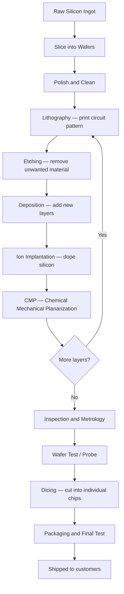

# Research: Semiconductor Wafer Fabrication

## Background

Semiconductor fabrication is the process of building microchips on thin circular discs of silicon called **wafers**. Every phone, laptop, car ECU, and medical sensor contains chips made this way.

A single wafer (usually 300 mm diameter) goes through hundreds of steps in a cleanroom before becoming finished chips. The whole journey can take 3–4 months.

---

## Fabrication Flow

---

## Key Concepts

### Wafer
- A disc of ultra-pure silicon, typically **300 mm** in diameter
- Holds hundreds of individual dies (chips)
- Must never be touched by bare hands — contamination destroys yield

### Die
- One individual chip on the wafer
- If a die fails inspection it is marked and discarded

### Cleanroom
- Fabrication happens in rooms rated by particles per cubic metre
- Any contamination = scrapped wafer = significant financial loss

### Yield
- Percentage of good dies per wafer
- Scheduler defects (such as missing the pickup window) directly destroy yield

---

## How This Simulation Maps to Real Fab

This simulation models a **single process step** inside one tool. In a real fab this would be one step out of hundreds.

| Concept | Real World | This Simulation |
|---|---|---|
| Load Port | Where cassettes of wafers dock to the tool | `LoadPort` class, 25 wafers |
| Robot | SCARA arm that moves wafers between stations | `Robot` class, 3-second move time |
| Pre-Heat Buffer | Warms wafer before entering process chamber | `PreHeatBuffer`, 3 slots, 10-second heat, **soft deadline** |
| Process Chamber | Where the actual process happens (etch, deposit, etc.) | `Chamber`, 20-second process, **6-second hard pickup window** |
| EFEM | Front-end module coordinating all of the above | The complete simulated system |

---

## Why Timing is Critical

In real semiconductor equipment:
- Wafers are often in a precise thermal or chemical state after processing
- **Leaving a wafer in a chamber after processing = overprocessing = scrap**
- This is why the simulation has a **6-second hard window** — miss it, the wafer is permanently damaged

In a real tool this translates directly to scrapped product and lost revenue.

---

## The Word "Scheduler" in Semiconductor Context

A scheduler in semiconductor equipment is a real-time decision engine that:
- Runs continuously in a loop
- Answers: "What should the robot do right now?"
- Must account for: what is free, what is about to expire, what is next in queue

A good scheduler maximises throughput (wafers per hour) while preventing damage (no missed pickup windows).

---

## Vocabulary

| Term | Meaning |
|---|---|
| WPH | Wafers Per Hour — the key throughput metric |
| FOUP | Front Opening Unified Pod — the cassette that holds wafers |
| Lot | A batch of wafers processed together |
| Recipe | The sequence of steps a wafer goes through |
| SEMI | Industry standards body for semiconductor equipment interfaces |
| OHT | Overhead Hoist Transport — moves FOUPs between tools in the fab |
