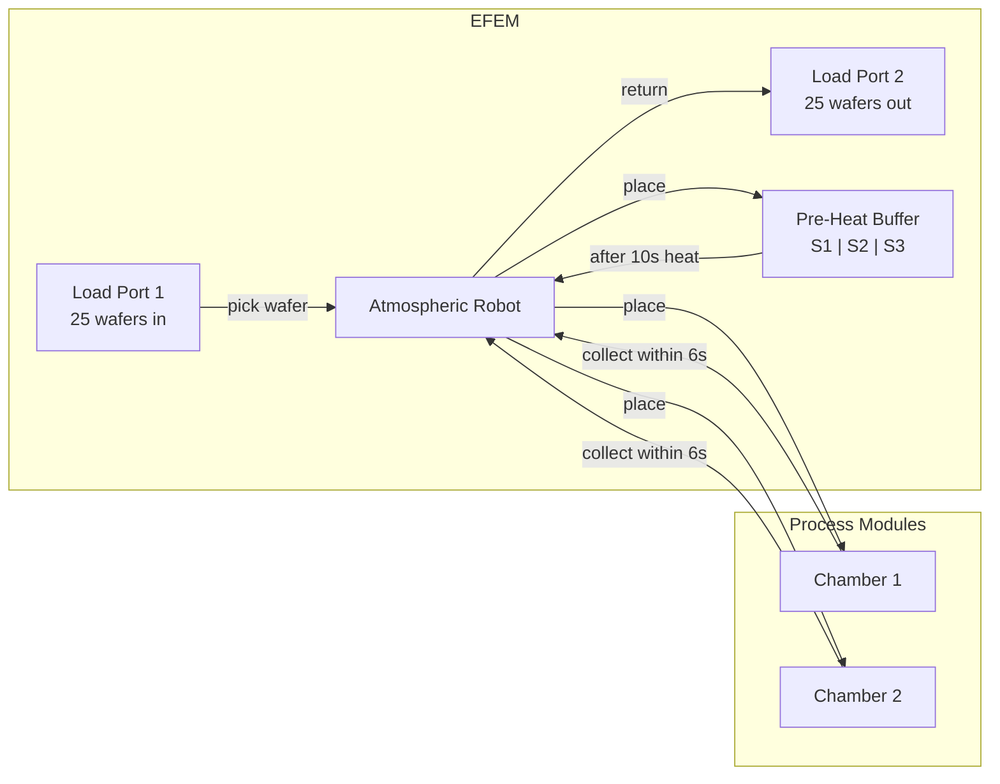
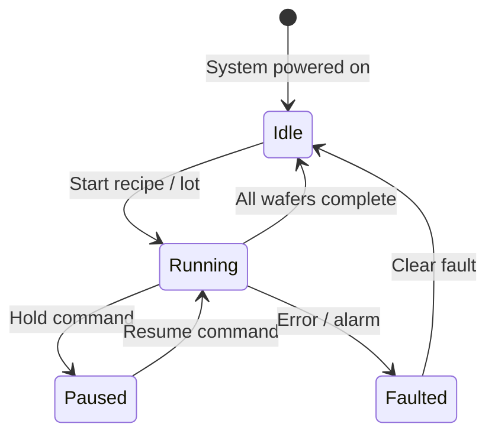
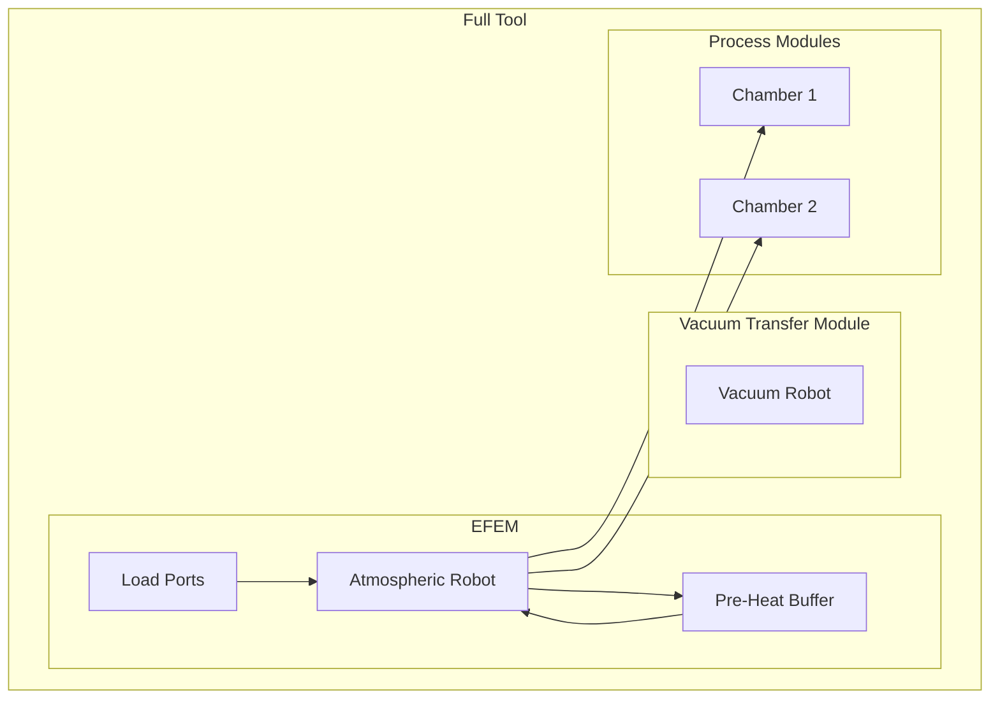
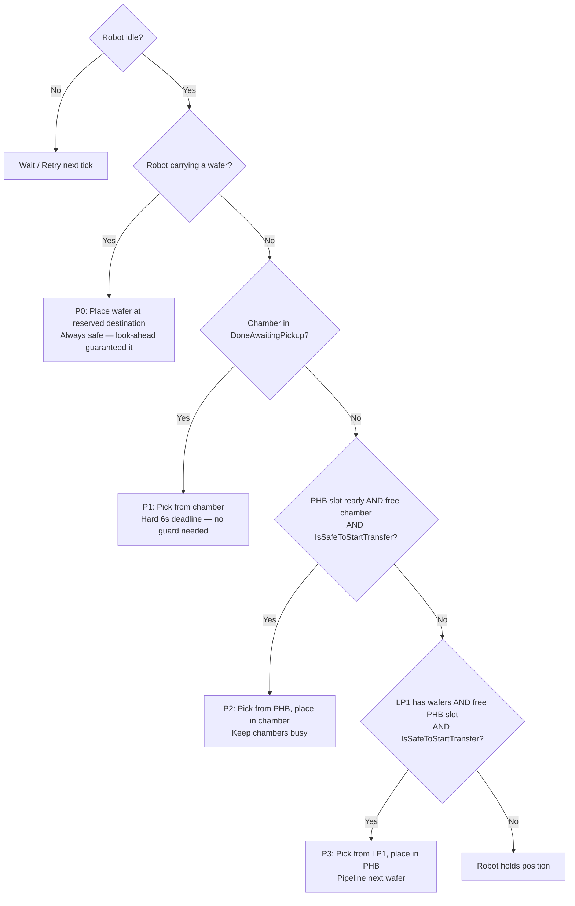

# Research: EFEM (Equipment Front End Module)

## What is an EFEM?

An **EFEM** (Equipment Front End Module) is the entry and exit point of a semiconductor process tool. It sits between the cleanroom environment and the process modules (chambers) inside the tool — the logistics hub of a wafer processing machine.

---

## Physical Layout

---

## EFEM Components

### Load Ports
- Docking points where FOUPs (wafer cassettes) attach to the tool
- In this simulation: LP1 is the input (25 wafers), LP2 is the output
- Robot picks from LP1 and deposits processed wafers into LP2

### Atmospheric Robot (SCARA Robot)
- Operates at atmospheric pressure
- Can only carry **one wafer at a time**
- In this simulation: every move = 3 seconds

### Pre-Heat Buffer (PHB)
- Warms wafers to process temperature before they enter the chamber
- Prevents thermal shock when a wafer enters the hot chamber
- **3 independent slots** — each slot heats independently (10 seconds)
- **Soft deadline** — a wafer that has finished heating can sit in the slot indefinitely without damage; it simply waits until the robot collects it

### Process Chambers (CH1, CH2)
- Where the actual semiconductor process runs (etching, deposition, etc.)
- One wafer at a time, **20 seconds processing**
- **Hard deadline**: after processing completes the robot must collect within **6 seconds** or the wafer is permanently damaged

---

## EFEM System States

---

## How the EFEM Fits Into a Bigger Tool

> In a real tool the chambers operate under vacuum. The EFEM runs at atmospheric pressure. A Load Lock transitions wafers between the two environments. This simulation models only the EFEM — no vacuum handling.

---

## Scheduler Responsibilities

The EFEM scheduler must:

1. **Track all component states** every tick
2. **Prioritise correctly** — chamber pickup beats new wafer loading
3. **Prevent conflicts** — never move the robot to a busy slot
4. **Respect timing constraints** — the 6-second pickup window is a hard deadline
5. **Maximise throughput** — keep chambers busy, fill pre-heat slots proactively

### Priority Decision Tree (implemented)

> `IsSafeToStartTransfer` blocks any transfer when a processing chamber has fewer than 4 seconds remaining — the robot could not reach the chamber within the pickup window. See [04-realtime-scheduling.md](04-realtime-scheduling.md) and [05-system-design.md](05-system-design.md) for the full look-ahead logic.

---

## Key EFEM Metrics

| Metric | What It Measures |
|---|---|
| WPH (Wafers Per Hour) | Primary throughput measure |
| Robot Utilisation | % time robot is moving vs idle |
| Chamber Utilisation | % time chamber is processing |
| Mean Transfer Time | Average time to move one wafer |
| Damage Rate | % wafers damaged (target: 0) |
