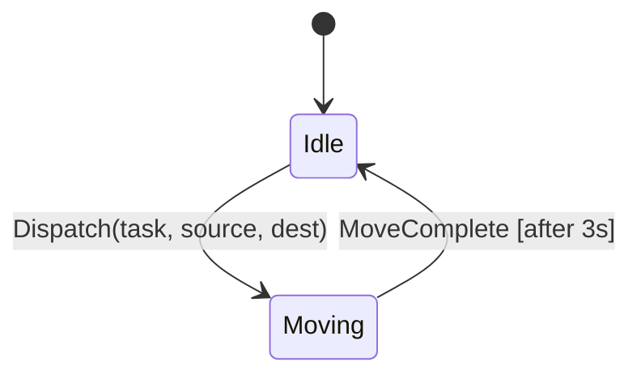
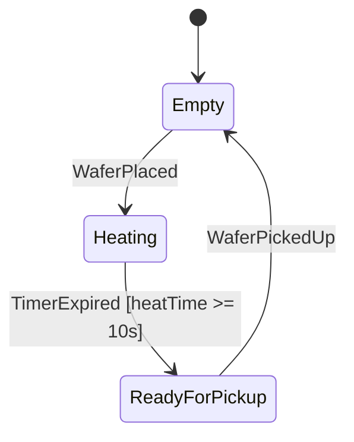
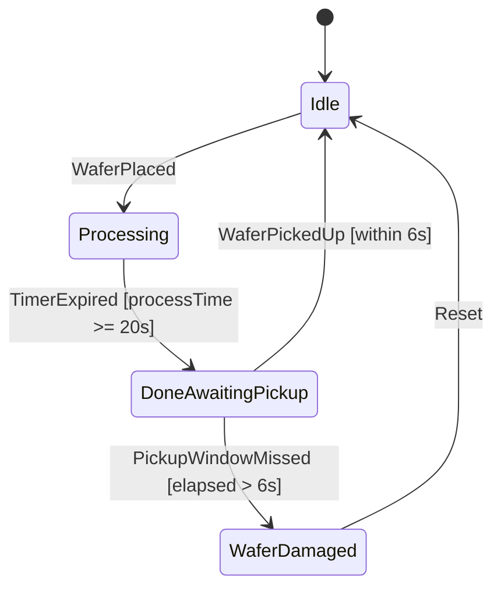
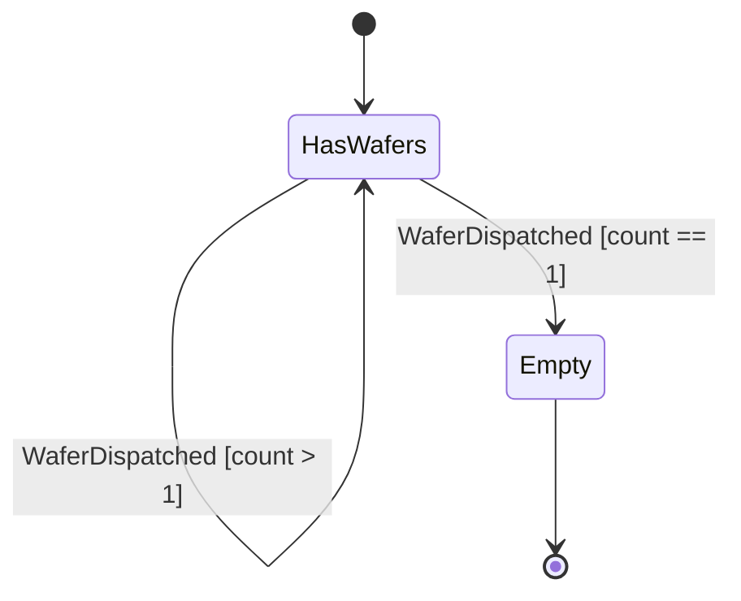
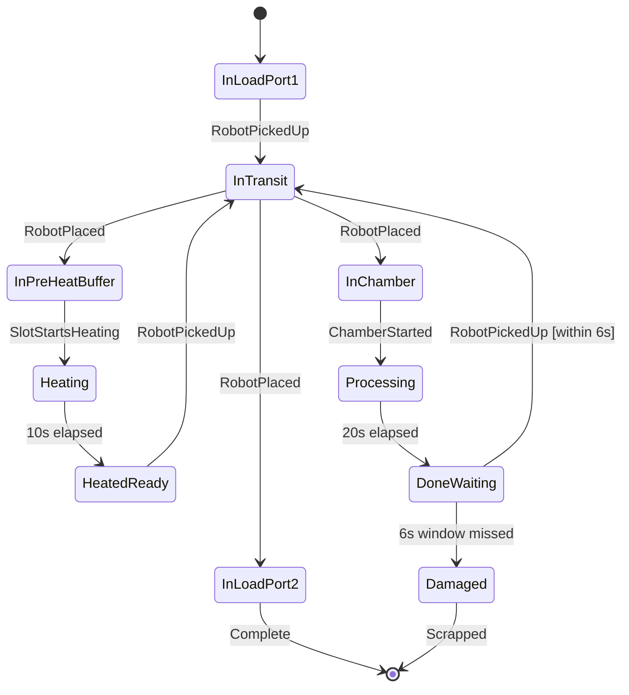
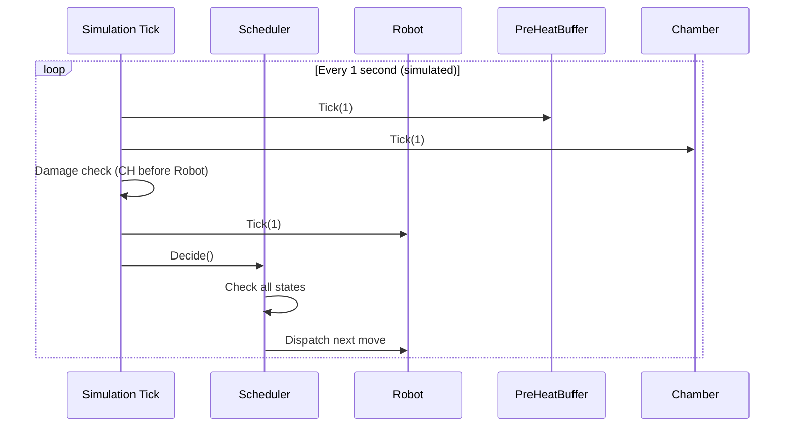

# Research: State Machines in Software

## What is a State Machine?

A **finite state machine (FSM)** is a model where a system is always in exactly ONE state at a time. An event causes a **transition** from one state to another. Each state defines what the system does while in it.

Every component in the EFEM — the robot, each buffer slot, each chamber — is modelled as a state machine.

---

## Core Concepts

| Term | Meaning |
|---|---|
| **State** | A distinct mode the object can be in (`Idle`, `Moving`, `Processing`) |
| **Transition** | A change from one state to another |
| **Event / Trigger** | What causes the transition (`PickupComplete`, `TimerExpired`) |
| **Guard** | A condition that must be true for a transition to fire |
| **Action** | Code that runs when a transition occurs |

---

## State Machine for Each EFEM Component

### Robot State Machine

The robot uses a **2-state model**:



`IsCarrying` is tracked as a separate boolean — it persists across two consecutive `Moving` states (pick move then place move):

```
Dispatch pick  → Moving (3s) → Idle, IsCarrying=true
Dispatch place → Moving (3s) → Idle, IsCarrying=false
```

```csharp
public enum RobotState { Idle, Moving }
// IsCarrying tracked separately as bool
```

---

### Pre-Heat Buffer Slot State Machine

Each of the 3 slots has its own independent state machine:



**Key point:** `ReadyForPickup` has no expiry — the wafer sits safely until the robot collects it (soft deadline). When state is `ReadyForPickup`, the scheduler may pick this wafer and move it to a free chamber.

```csharp
public enum BufferSlotState { Empty, Heating, ReadyForPickup }
```

---

### Chamber State Machine



The transition from `DoneAwaitingPickup` to `WaferDamaged` is time-driven and automatic. The scheduler must prevent it via the look-ahead guard.

```csharp
public enum ChamberState { Idle, Processing, DoneAwaitingPickup, WaferDamaged }
```

**Damaged chamber handling:** `WaferDamaged → Idle` requires an explicit `ch.Reset()` call. Without it the chamber is stuck and the simulation deadlocks. The damage check runs **after** chambers tick but **before** the robot ticks — this ordering is critical (see [05-system-design.md](05-system-design.md)):

```csharp
// After ch.Tick(), before robot.Tick():
foreach (var ch in _chambers)
{
    if (ch.State == ChamberState.WaferDamaged)
    {
        DamagedCount++;
        ch.Reset(); // Wafer = null, State = Idle
    }
}
```

The completion check accounts for damaged wafers:
```csharp
bool allDone = (_lp2.WaferCount + DamagedCount) >= totalWafers;
```

---

### Load Port State Machine



---

### Wafer Lifecycle State Machine



---

## Implementing State Machines in C#

### Enum + Switch (used in this project)

```csharp
public class Chamber
{
    public ChamberState State { get; private set; } = ChamberState.Idle;
    private int _elapsedSeconds = 0;
    private int _postProcessSeconds = 0;

    public void Tick(int seconds, int simulatedTime)
    {
        switch (State)
        {
            case ChamberState.Processing:
                _elapsedSeconds += seconds;
                if (_elapsedSeconds >= 20)
                {
                    State = ChamberState.DoneAwaitingPickup;
                    _postProcessSeconds = 0;
                }
                break;

            case ChamberState.DoneAwaitingPickup:
                _postProcessSeconds += seconds;
                if (_postProcessSeconds > 6)
                    State = ChamberState.WaferDamaged;
                break;
        }
    }
}
```

---

## Simulation Loop and State Machines



---

## Guards Prevent Invalid Transitions

Guards are conditions checked before allowing a state transition:

| Transition | Guard |
|---|---|
| Robot places wafer in PHB slot | Slot must be `Empty` |
| Robot picks wafer from PHB | Slot must be `ReadyForPickup` AND free chamber exists AND `IsSafeToStartTransfer()` |
| Robot places wafer in Chamber | Chamber must be `Idle` |
| Robot picks wafer from Chamber | Chamber must be `DoneAwaitingPickup` |
| Scheduler dispatches any new pick | Robot must be `Idle` AND `IsCarrying == false` |
| Scheduler dispatches place | Robot must be `Idle` AND `IsCarrying == true` (Priority 0) |
| Scheduler starts LP1→PHB transfer | `IsSafeToStartTransfer()` must return true |
