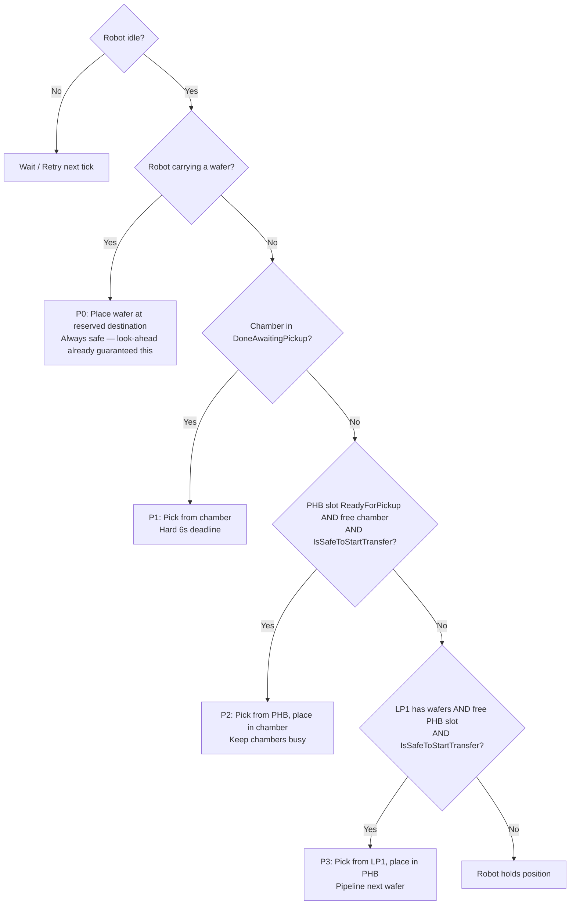

# Research: Real-Time Scheduling

## What is Real-Time Scheduling?

**Real-time scheduling** is about making decisions under timing constraints where being late has consequences — from degraded performance to catastrophic failure.

In this EFEM simulation:
- Missing the **6-second chamber pickup window** = permanently damaged wafer = **hard deadline**
- Robot waiting unnecessarily = wasted throughput = **soft deadline**

---

## Two Types of Real-Time Constraints

| Type | Description | Example in this simulation |
|---|---|---|
| **Hard deadline** | Must be met — missing it = unrecoverable failure | Chamber 6-second pickup window |
| **Soft deadline** | Should be met — missing it = degraded performance | Robot idle time, throughput |

---

## Scheduling Algorithms

### First Come First Served (FCFS)
- Process tasks in the order they arrive
- Simple and fair, but ignores urgency
- **Problem for EFEM:** does not prioritise the chamber pickup deadline

### Priority Scheduling
- Assign priority levels; highest priority runs first
- This simulation uses this approach: chamber done = highest priority
- Works well when priorities are stable and clear

### Earliest Deadline First (EDF)
- The task with the nearest deadline runs first
- Applied here: a chamber about to miss its window beats everything
- Note: EDF is optimal for preemptive scheduling. The robot cannot drop a wafer mid-move (non-preemptive), so the approach is **EDF-style thinking** applied to a fixed-priority hierarchy

### Polling vs Event-Driven
- This simulation uses a **polling loop** (tick every 1 second, check all state)
- Industry alternative: **Discrete Event Simulation** — time jumps to the next event, far more scalable for large systems
- The scheduling logic (P0–P3, look-ahead) would be identical in both; only the time-advance engine differs

---

## Scheduler Priority Hierarchy (implemented)

This is the core design decision:



**Why this order:**

- **P0 first:** After a pick, the robot holds a wafer with a reserved destination. P0 ensures it completes the current transfer before doing anything else.
- **P1 before P2/P3:** The chamber has a hard 6-second deadline. A pre-heated wafer in the buffer has no expiry — it waits safely.
- **P2 before P3:** Chambers are the throughput bottleneck. Feeding them takes priority over loading the buffer.

---

## Look-Ahead Guard: `IsSafeToStartTransfer`

Before starting any transfer (LP1→PHB or PHB→Chamber), the scheduler checks whether a processing chamber could finish before the robot can reach it.

```
Robot arrival at chamber = 9s
  = 3s pick + 3s place + 3s travel to chamber

Chamber deadline = ProcessingSecondsRemaining + 6s window

Block if: 9 > (remaining + 6) - SafetyMargin
       → block if remaining < 4  (with SafetyMargin = 1)
```

| remaining | safe? |
|---|---|
| 6+ | Allow |
| 5 | Allow |
| 4 | Allow (9 == 9, boundary is safe) |
| 3 | Block |
| 2 | Block |

```csharp
private bool IsSafeToStartTransfer()
{
    int robotArrival = 9; // 3s pick + 3s place + 3s travel

    foreach (var ch in _chambers)
    {
        if (ch.State != ChamberState.Processing) continue;
        int deadline = ch.ProcessingSecondsRemaining + 6;
        if (robotArrival > deadline - SafetyMargin)
            return false;
    }
    return true;
}
```

When this guard blocks, the robot holds position near the chamber — this is **intentional idle time**, not a scheduling flaw.

---

## Pipeline Thinking

Good scheduling keeps multiple wafers in flight simultaneously so no station starves:

```mermaid
gantt
    title Wafer Pipeline (Illustrative)
    dateFormat ss
    axisFormat %S s

    section Wafer 1
    LP1 to PHB (6s total)    :w1_a, 00, 6s
    PHB Heating (10s)         :w1_b, after w1_a, 10s
    PHB to CH1 (6s total)    :w1_c, after w1_b, 6s
    CH1 Processing (20s)      :w1_d, after w1_c, 20s
    CH1 to LP2 (6s total)    :w1_e, after w1_d, 6s

    section Wafer 2
    LP1 to PHB (6s total)    :w2_a, 06, 6s
    PHB Heating (10s)         :w2_b, after w2_a, 10s
    PHB to CH2 (6s total)    :w2_c, after w2_b, 6s
    CH2 Processing (20s)      :w2_d, after w2_c, 20s
    CH2 to LP2 (6s total)    :w2_e, after w2_d, 6s
```



> Each robot transfer = 2 dispatches × 3s = 6s total. With 3 PHB slots and 2 chambers, the scheduler keeps multiple wafers in flight.

---

## Robot Idle Time

Idle time accumulates when:
1. All PHB slots are occupied (heating)
2. All chambers are busy (processing)
3. The look-ahead guard is blocking a transfer (intentional hold)

**Episode-based wait counting:** a single 30-second blockage = 30 idle seconds but **1 wait episode**. The `_wasWaiting` flag ensures each continuous blocked period counts once:

```csharp
private void TrackWait()
{
    bool wantedToMove = (_lp1.HasWafers && !_buffer.HasFreeSlot) ||
                        (_buffer.HasReadySlot && GetFreeChamber() == null);

    if (wantedToMove)
    {
        if (!_wasWaiting) { RobotWaitCount++; _wasWaiting = true; }
    }
    else
    {
        _wasWaiting = false;
    }
}
```

---

## Simulation Loop Structure

```csharp
while (!IsComplete(totalWafers) && SimulatedTime < 2000)
{
    // 1. Advance timers
    _buffer.Tick(1);
    foreach (var ch in _chambers) ch.Tick(1, SimulatedTime + 1);

    // 2. Damage check BEFORE robot acts (tick-order critical)
    foreach (var ch in _chambers)
    {
        if (ch.State == ChamberState.WaferDamaged)
        { DamagedCount++; ch.Reset(); }
    }

    // 3. Robot ticks (arrives at destination, executes action)
    _robot.Tick(1, SimulatedTime + 1, _lp1, _lp2, _buffer, _chambers);

    SimulatedTime++;

    // 4. Scheduler decides next move
    bool dispatched = Decide();

    // 5. Track idle time
    if (_robot.IsIdle && !dispatched) RobotIdleTime++;
}
```

**Why damage check before robot tick:** if the robot ticked first, it could arrive at a chamber in the same tick it damages the wafer, scoop the wafer before `Reset()` runs, and the damage count would never increment.

---

## Expected Results

With 25 wafers, 3 PHB slots, 2 chambers, 3s moves, 10s heat, 20s process:

| Metric | Value |
|---|---|
| Total simulated time | ~507s |
| Wafers processed | 25 |
| Damaged wafers | 0 |
| Robot wait episodes | 12 |
| Robot idle time | ~57s |

The robot is the throughput bottleneck — not the chambers. Every second of unnecessary robot idle time directly extends total simulation time.
