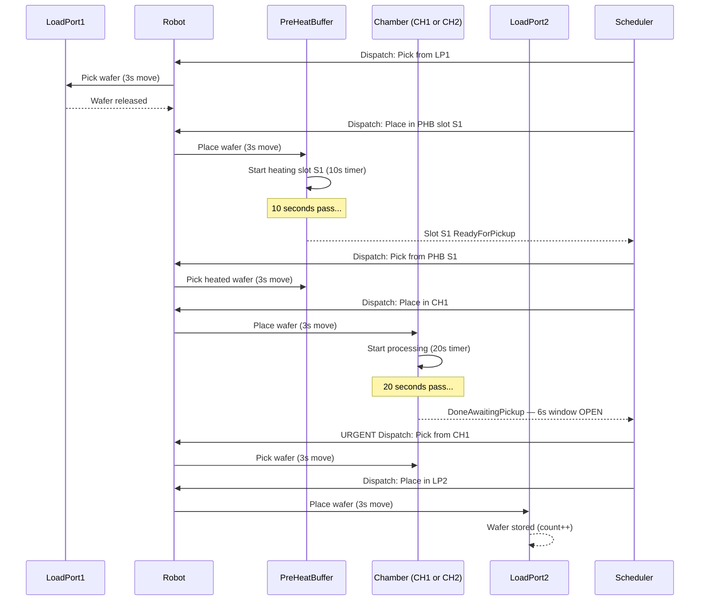
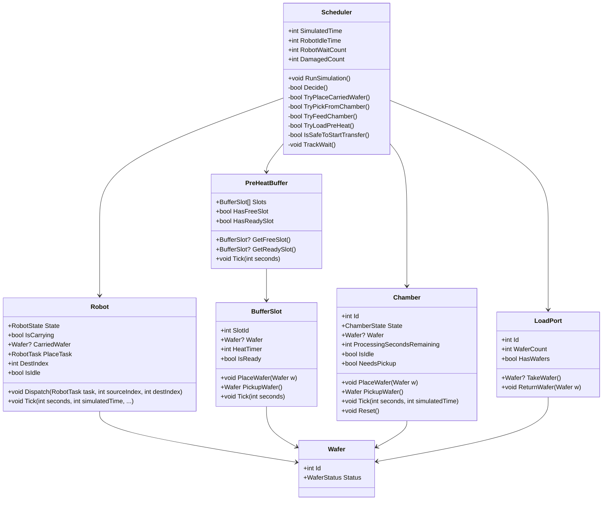

# Design: System Blueprint

## Full System Flow — Sequence Diagram



---

## Class Diagram



---

## Enums

```csharp
public enum RobotState { Idle, Moving }

public enum RobotTask
{
    None,
    PickFromLP1, PlaceInPHB,
    PickFromPHB, PlaceInChamber,
    PickFromChamber, PlaceInLP2
}

public enum BufferSlotState { Empty, Heating, ReadyForPickup }

public enum ChamberState { Idle, Processing, DoneAwaitingPickup, WaferDamaged }

public enum WaferStatus { InQueue, InTransit, Heating, Processing, Complete, Damaged }
```

---

## Project Structure

```
Mindox_Assignment/
├── EFEMSimulator/
│   ├── EFEMSimulator.csproj
│   ├── Program.cs              ← entry point
│   ├── Scheduler.cs            ← scheduling engine (not in Models/)
│   └── Models/
│       ├── Wafer.cs
│       ├── LoadPort.cs
│       ├── Robot.cs
│       ├── BufferSlot.cs
│       ├── PreHeatBuffer.cs
│       └── Chamber.cs
├── docs/
│   └── design/                 ← this folder
└── reflection.md
```

> `Scheduler.cs` lives directly in `EFEMSimulator/` (not in `Models/`) — it orchestrates all components rather than modelling one component.

---

## Key Design Decisions

### Decision 1 — Two-dispatch robot model

Every wafer transfer is two separate robot dispatches:

```
Step 1: Scheduler dispatches "Go pick from PHB S1" → robot travels 3s, picks wafer
Step 2: Scheduler immediately dispatches "Go place in CH1" → robot travels 3s, places wafer
```

Total transfer time = 6s. The destination is reserved at pick time (`DestIndex`) so Priority 0 always knows where to go.

---

### Decision 2 — Look-ahead guard (blocks transfers near chamber deadline)

Before starting any transfer, check whether a processing chamber could finish before the robot arrives:

```
Robot arrival = 9s (3+3+3)
Deadline = remaining + 6
Block if: 9 > (remaining + 6) - SafetyMargin
       → block when remaining < 4
```

```csharp
private bool IsSafeToStartTransfer()
{
    int robotArrival = 9;
    foreach (var ch in _chambers)
    {
        if (ch.State != ChamberState.Processing) continue;
        int deadline = ch.ProcessingSecondsRemaining + 6;
        if (robotArrival > deadline - SafetyMargin) return false;
    }
    return true;
}
```

---

### Decision 3 — FIFO slot selection prevents starvation

Without ordering, the scheduler always picks slot S1 over S2 over S3 (first match in array). In testing, Slot S3 was skipped for 456 seconds. Fixed by ordering by wafer ID:

```csharp
public BufferSlot? GetReadySlot()
{
    return Slots.Where(s => s.IsReady).OrderBy(s => s.Wafer!.Id).FirstOrDefault();
}
```

Wafer IDs are assigned in arrival order, so lowest ID = oldest wafer = FIFO.

---

### Decision 4 — Tick order: damage check before robot tick

The damage check must run after chambers tick but before the robot ticks:

```csharp
foreach (var ch in _chambers) ch.Tick(1, SimulatedTime + 1);

// damage check HERE — not after robot.Tick()
foreach (var ch in _chambers)
{
    if (ch.State == ChamberState.WaferDamaged)
    { DamagedCount++; ch.Reset(); }
}

_robot.Tick(1, SimulatedTime + 1, ...);
```

If the robot ticked first, it could arrive at a chamber the same tick it damages and pick up before `Reset()` runs — silently missing the count.

---

### Decision 5 — Null guard in robot for cleared chambers

When damage occurs and the robot was already en route to pick from that chamber, it arrives to find `ch.Wafer == null`. Explicit null guard prevents a crash:

```csharp
case RobotTask.PickFromChamber:
    var pickChamber = chambers[_sourceIndex - 1];
    if (pickChamber.Wafer == null)
    {
        Console.WriteLine($"[t={simulatedTime:D4}s] ROBOT  CH{_sourceIndex} already cleared — pick skipped");
    }
    else
    {
        CarriedWafer = pickChamber.PickupWafer();
        IsCarrying = true;
        PlaceTask = RobotTask.PlaceInLP2;
    }
    break;
```

---

## Sample Event Log (first wafer)

```
[t=0001s] SCHED  Dispatch: pick from LP1 -> PHB S1
[t=0004s] ROBOT  Picked W01 from LoadPort1
[t=0004s] SCHED  Dispatch: place W01 in PHB S1
[t=0007s] ROBOT  Placed W01 in PHB Slot S1 — heating started
[t=0017s] PHB S1 ready (W01 heated)
[t=0017s] SCHED  Dispatch: pick from PHB S1 -> CH1
[t=0020s] ROBOT  Picked W01 from PHB Slot S1
[t=0020s] SCHED  Dispatch: place W01 in CH1
[t=0023s] ROBOT  Placed W01 in CH1 — processing started
[t=0043s] CH1 processing complete — pickup window open (6s)
[t=0043s] SCHED  Dispatch: pick from CH1
[t=0046s] ROBOT  Picked W01 from CH1         ← 3s into 6s window, safe
[t=0046s] SCHED  Dispatch: place W01 in LP2
[t=0049s] ROBOT  Placed W01 in LoadPort2 — COMPLETE
```

---

## Final Stats (25 wafers, standard run)

```
==============================================
  SIMULATION COMPLETE
==============================================
  Total wafers processed : 25
  Damaged wafers         : 0
  Total simulated time   : 507s
  Robot wait episodes    : 12
  Robot idle time        : 57s
==============================================
```
